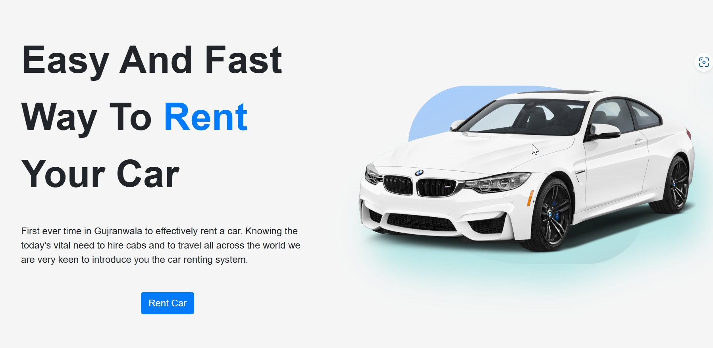
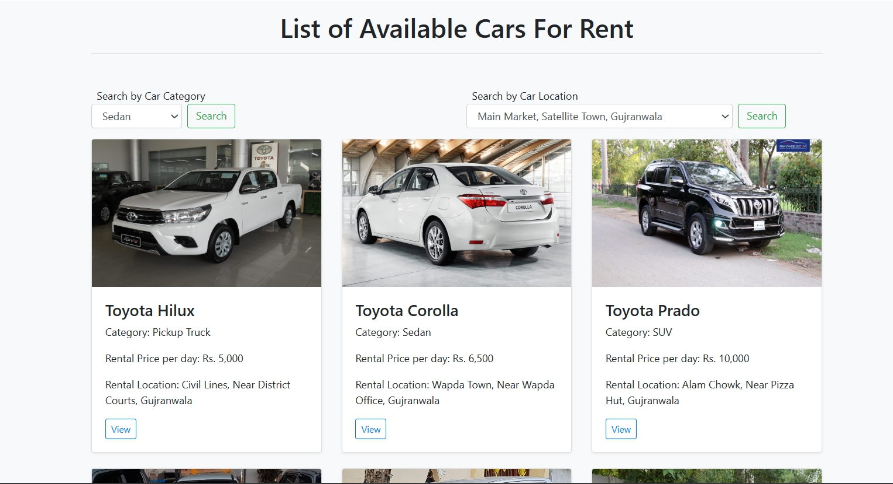
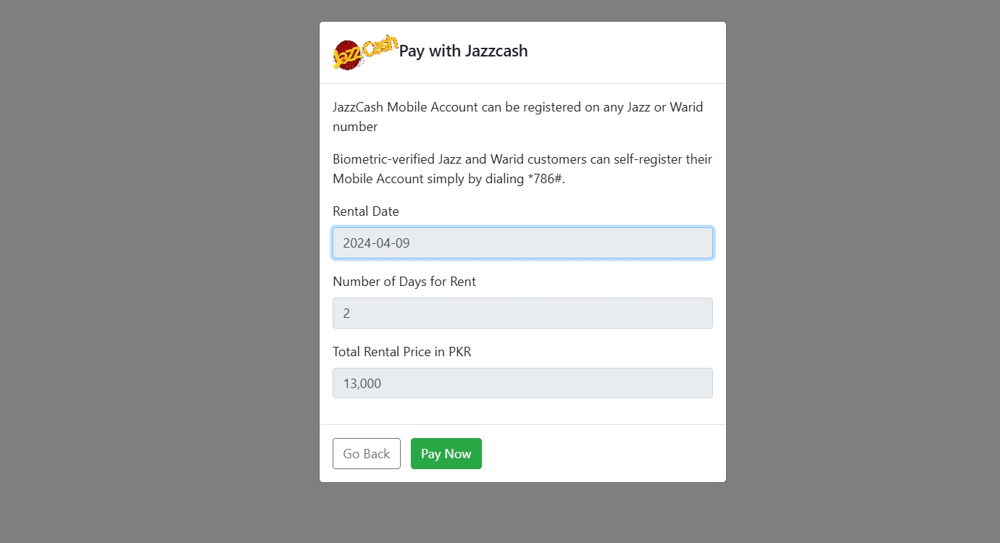
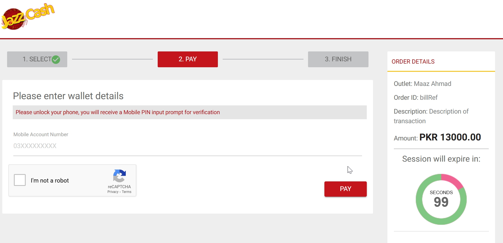
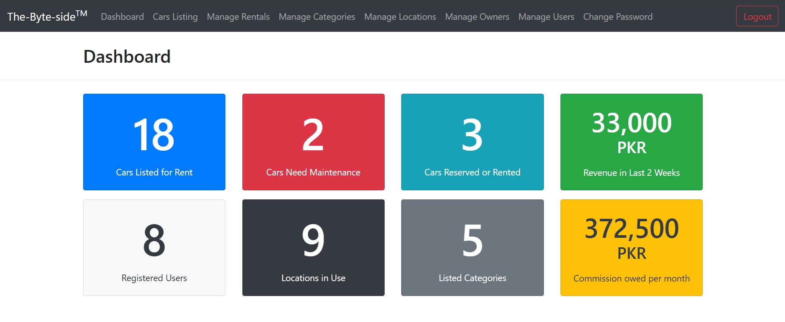

# Car Rental System

## Overview
A web application for managing car rentals, allowing users to browse, book, and manage their rentals seamlessly.

## Features
- User registration and login
- Browse and search cars
- Book rentals
- Admin panel for managing cars and bookings
- Payment integration

## Technologies Used
HTML, CSS, Bootstrap, jQuery, DataTables, PHP, MySQL, JazzCash Payment Gateway

## Documentation
[Download the PDF](CRMS%20Documentation.pdf)

## Installation
1. **Download and Install XAMPP**  
   [Link to Download XAMPP](https://www.apachefriends.org/download.html)  
   *(If asked, make sure the firewall allows both private and public access to the features of XAMPP)*

2. **Open XAMPP Control Panel**  
   Start the Apache and MySQL services.

3. **Put the 'crms' Folder**  
   Place the 'crms' folder inside the following path:  
   `C:\xampp\htdocs\`

4. **Configure Database**  
   - Open a browser and go to the URL: `http://localhost/phpmyadmin/`  
     This will open the database settings for the project.  
   - Create a database named **"crms"**.  
   - Import the database located in the `crms/database` folder.  
     Path: `C:\xampp\htdocs\crms\database\crms.sql`

5. **Access the Application**  
   Open a browser and go to the URL:  
   - `http://localhost/crms/`  
   - or `http://localhost/crms/admin/`

## Login Details

- **User:**  
  - Username: `talhabsit@gmail.com`  
  - Password: `1234`

- **Admin:**  
  - Username: `admin`  
  - Password: `123`

## Screenshots

